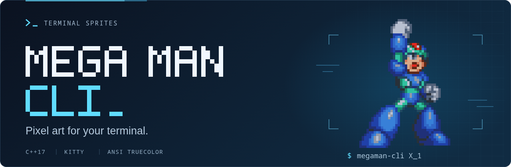
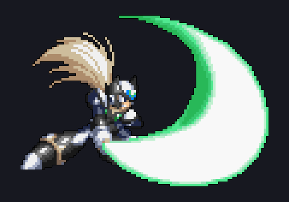
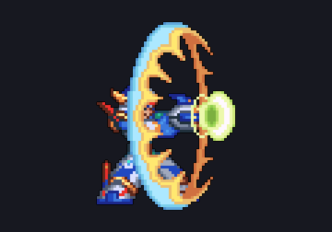
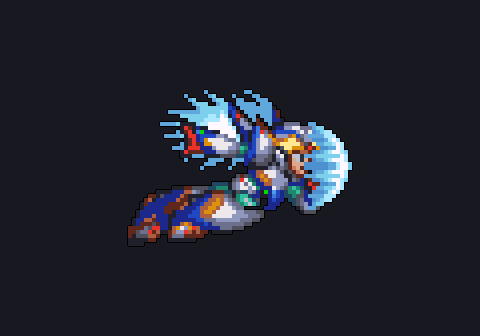

# Mega Man CLI

Display Mega Man sprites as compact, sharp pixel art in Kitty, with ANSI truecolor
text output for other UTF-8 terminals. Written in C++17; uses libpng to decode the
images. No external image viewer, Python, or network connection is needed at runtime.

Running the command without arguments prints a random sprite and exits—there is
no interactive menu, so it can be used in a shell startup file.

## Terminal preview

A few of the included poses, captured from the CLI's Kitty graphics output and
placed on a solid dark background. Your terminal's font size and background
affect the final appearance; other terminals use ANSI half-blocks instead.

| Black Zero — saber slash | X — charged shot | Falcon Armor X — flight |
| :---: | :---: | :---: |
|  |  |  |

Try these poses in your terminal:

```sh
./build/megaman-cli x4_black_zero_saber --no-title
./build/megaman-cli X_shoot_charged_armor --no-title
./build/megaman-cli x5_falcon_flight --no-title
```

## Build

Requirements: Linux, a C++17 compiler, CMake 3.16 or newer, and libpng development
headers. Kitty supports the required Unicode half-blocks and 24-bit ANSI colors.

On Arch Linux:

```sh
sudo pacman -S --needed base-devel cmake libpng
```

On Debian/Ubuntu:

```sh
sudo apt install build-essential cmake libpng-dev
```

Build and run from this directory:

```sh
cmake -S . -B build -DCMAKE_BUILD_TYPE=Release
cmake --build build --parallel
./build/megaman-cli
```

Optional renderer edge-case checks (requires Python 3, standard library only):

```sh
ctest --test-dir build --output-on-failure
```

CMake registers these checks when Python 3 is available. They exercise native
pixel fidelity, palette-preserving reduction, whole-number enlargement, thin
outlines, transparency, terminal fit, odd image heights, and corrupt PNG input.

## Usage

```sh
./build/megaman-cli                         # Random sprite
./build/megaman-cli --list                   # Available PNG names
./build/megaman-cli --name x4_x_ultimate_idle
./build/megaman-cli x4_black_zero_saber
./build/megaman-cli x1_sigma_saber
./build/megaman-cli x1_storm_eagle_wings --no-title
./build/megaman-cli x5_falcon_flight --width 60 --height 30
./build/megaman-cli x4_iris_stand --no-title
./build/megaman-cli --help
```

| Option | Meaning |
| --- | --- |
| `-r`, `--random` | Display one random sprite; also the default action |
| `-n`, `--name NAME` or positional `NAME` | Select a filename without `.png` |
| `-l`, `--list` | List all available names without color escapes |
| `-w`, `--width COLUMNS` | Maximum artwork width, including outline; default is compact in Kitty, native-size ANSI elsewhere |
| `--height ROWS` | Maximum artwork height, including outline; explicit limits allow whole-number enlargement |
| `--no-title` | Omit the sprite name |
| `--no-outline` | Keep the original sprite edges without the added black contour |
| `--ansi` | Force ANSI half-block output, including in Kitty |
| `--sprites-dir DIR` | Read PNGs from a different directory |
| `-h`, `--help` | Show help without loading any assets |

Names match exactly first, then case-insensitively if unambiguous. Selection,
listing, and explicit random selection are mutually exclusive. Errors go to
standard error and return a nonzero exit status.

The renderer trims transparent padding. **Kitty displays the sprite at roughly
half the ANSI width and height without discarding source pixels.** Each source
pixel becomes a smaller, equally sized square of device pixels. The image is
scaled with nearest-neighbor sampling before transmission, so Kitty displays it
at its exact device-pixel size without smoothing.

Automatic graphics output requires `TERM=xterm-kitty`, stdout attached to a
terminal, and usable pixel dimensions from that terminal. Other terminals,
tmux/screen sessions, missing pixel dimensions, and redirected output use the
existing ANSI renderer. `--ansi` explicitly selects that renderer. ANSI uses two
vertical pixels per cell and keeps native detail when space permits; making it
smaller at the same font size necessarily discards detail.

A one-output-pixel black contour separates opaque pixels from terminal
wallpapers; source colors are never replaced. In Kitty the contour is one device
pixel thick. Use `--no-outline` for the original edges. Diagonal corners remain
transparent rather than creating a rectangular halo.

**No color averaging or smoothing is used.** Whole-number enlargement keeps
source pixels equally sized. Width and height are bounding limits, not stretching
controls; supplying either enables the largest whole-number scale that fits
**both** the requested limits and the terminal, including the outline. Without
explicit limits, Kitty uses the compact scale and ANSI does not enlarge.
If even one device pixel per source pixel cannot fit (or one ANSI output pixel
in text mode), nearest-neighbor reduction fits the bounds but can discard small
features. Very small explicit limits therefore cannot guarantee lossless detail.

The renderer uses the attached terminal's reported dimensions, leaving one column
to avoid wrapping and reserving rows for the title and following prompt. Unknown
dimensions, including redirected output, use an 80-column by 24-row fallback.
Limits too small for an outlined pixel report an error; use `--no-outline` or
larger limits. Size arguments must be integers from 1 to 1000. PNGs are limited to
8192 pixels per axis and 16 megapixels decoded.

ANSI cells cannot represent partial opacity: source alpha below 128 is transparent;
alpha at least 128 contributes its exact RGB color. Hidden RGB never tints the
result. Transparent pixels keep your terminal's default background, and colors
are reset after every row. Opaque black remains black. Custom opaque image
backgrounds are rendered as supplied; the renderer does not guess which colors
to remove. Output retains ANSI colors when redirected to a file.

## Install and use on shell startup

Install under your account; this does not edit terminal or shell configuration:

```sh
cmake --install build --prefix "$HOME/.local"
```

This installs the executable to `~/.local/bin/megaman-cli`, PNGs to
`~/.local/share/megaman-cli/sprites`, and this file with its asset credits to
`~/.local/share/doc/megaman-cli/README.md`. Ensure `~/.local/bin` is on `PATH`.
The installed command finds its assets independently of the working directory.
Keep the installed share directory alongside the executable when relocating it;
copying the executable alone does not bundle the PNGs.

To display a sprite when opening Kitty (or another terminal), put the command in
its interactive shell's startup file—not directly in `kitty.conf`.

For Bash (`~/.bashrc`) or Zsh (`~/.zshrc`):

```sh
if [[ $- == *i* ]] && [[ -t 1 ]] && command -v megaman-cli >/dev/null 2>&1; then
    megaman-cli --random --no-title
fi
```

For Fish (`~/.config/fish/config.fish`):

```fish
if status is-interactive; and isatty stdout; and type -q megaman-cli
    megaman-cli --random --no-title
end
```

These examples run on each interactive shell, including nested shells. For a
fixed character, replace `--random` with `--name x4_black_zero_idle`, for example.
No startup files are modified by the build or installation.

## Add your own sprites

Put individual PNG poses, not whole sprite sheets, in `mm-sprites/pngs/` during
development and rerun installation to copy additions into an installed setup.
The filename stem becomes the CLI name. Transparent, tightly cropped,
native-resolution pixel art gives the best results. The legacy enlarged,
anti-aliased PNGs have been replaced in place with native game frames; their CLI
names still work. The old shell-style files outside `pngs/` are not executed or
used by the renderer.

You can also use any PNG directory without rebuilding:

```sh
megaman-cli --sprites-dir /path/to/poses --list
MEGAMAN_SPRITES_DIR=/path/to/poses megaman-cli --random
```

Lookup order: `--sprites-dir`, then nonempty `MEGAMAN_SPRITES_DIR`, then installed
assets relative to the executable, `mm-sprites/pngs` beside the executable, the
configured installation path, the configured source tree, and finally
`mm-sprites/pngs` in the current directory. An explicit directory override is
authoritative: missing or empty directories report an error rather than silently
falling back to unrelated assets.

## Sprite collection and credits

The collection contains **29 native-resolution PNGs**. The 12 legacy filenames
now hold original game frames rather than enlarged, anti-aliased artwork.
**Falcon Armor is from Mega Man X5, not X4.**

The README banner uses the `X_1` victory pose credited below; its editable source
is [`docs/images/banner.svg`](docs/images/banner.svg).

| Game / character | CLI names |
| --- | --- |
| X1 Sigma | `x1_sigma_cape`, `x1_sigma_saber` |
| X1 Chill Penguin | `x1_chill_penguin_idle`, `x1_chill_penguin_jump` |
| X1 Storm Eagle | `x1_storm_eagle_idle`, `x1_storm_eagle_wings` |
| X4 Ultimate Armor X | `x4_x_ultimate_idle`, `x4_x_ultimate_dash`, `x4_x_ultimate_nova_strike` |
| X4 Iris | `x4_iris_stand`, `x4_iris_float` |
| X4 Black Zero | `x4_black_zero_idle`, `x4_black_zero_run`, `x4_black_zero_saber` |
| X5 Falcon Armor X | `x5_falcon_idle`, `x5_falcon_shoot`, `x5_falcon_flight` |

- **Sigma:** ripped by **Eureka Drama X**; hosted by
  [Sprite Database](https://spritedatabase.net/file/19523)
  ([source sheet](https://spritedatabase.net/files/snes/464/Sprite/MMX_Sigma.png)).
  Native caped and saber-swing frames from Mega Man X (SNES), preserving the
  source PNG's transparency and the complete saber arc.
- **Chill Penguin:** sheet credits **Blarcox**; contributed to
  [Sprite Database by Freedom Fighter](https://spritedatabase.net/file/8187)
  ([source sheet](https://spritedatabase.net/files/snes/464/Sprite/ChillPenguin.gif)).
  Native standing and airborne frames from Mega Man X (SNES). Only the exact
  green sheet background, RGB `(152, 224, 155)`, was made transparent.
- **Storm Eagle:** ripped and contributed by **Freedom Fighter**; hosted by
  [Sprite Database](https://spritedatabase.net/file/8197)
  ([source sheet](https://spritedatabase.net/files/snes/464/Sprite/StormEagle.gif)).
  Native standing and raised-wing frames from Mega Man X (SNES). Only the exact
  pink sheet background, RGB `(222, 160, 160)`, was made transparent.
- **Ultimate Armor X:** ripped by **NIK**, who requests credit; hosted by
  [Sprite Database](https://spritedatabase.net/file/5029)
  ([source sheet](https://spritedatabase.net/files/ps1/879/Sprite/X4-UltimateArmor.PNG)).
  Native frames from the sheet's IDLE, DASH, and NOVA STRIKE rows, not its
  custom/MISC section. The black sheet background was made transparent; character
  colors were retained. The Nova Strike pose includes the armored body without
  the large attack trail.
- **Iris:** [Sprites INC X4 archive](https://sprites-inc.com/sprite.php?local=X/X4/Boss/FortressBoss/ScreenCapture/)
  ([source sheet](https://sprites-inc.com/files/X/X4/Boss/FortressBoss/ScreenCapture/x4_Iris.gif)).
  Native frames with the GIF's transparency preserved. This archive labels the
  sheet as a screen capture/reference with an uncorrected palette; these PNGs
  preserve that archived palette, not an independently corrected tile rip.
- **Black Zero:** [Sprites INC Zero archive](https://sprites-inc.com/sprite.php?local=X/Zero/X4-X5/)
  ([pose sheet](https://sprites-inc.com/files/X/Zero/X4-X5/zerox4sheet.gif),
  [palette reference](https://sprites-inc.com/files/X/Zero/X4-X5/zerox4recolours.gif)).
  X4 poses use the exact color mapping between the reference normal Zero and
  green-saber Black Zero frames. No colors were invented; the entire saber arc
  is retained.
- **Falcon Armor X:** [Sprites INC X5 armor archive](https://sprites-inc.com/sprite.php?local=X/X/Armors/X5/)
  ([source sheet](https://sprites-inc.com/files/X/X/Armors/X5/x5sheet1falcon.gif)).
  Native idle, shooting, and flight poses, preserving source colors and
  transparency. Shooting/flight effects are included.

### Replacement frames under legacy names

- **`X_1`, `X_2`:** native X4 raised-fist victory and idle frames from
  [Sprites INC's base X sheet](https://sprites-inc.com/files/X/X/X4-X6/mmx_x4_x_sheet.gif).
  Original GIF transparency is preserved; the victory frame replaces the old
  raised-arm artwork.
- **`X_fourth_armor`, `X_nova_strike`, `X_nova_strike_blue`,
  `X_shoot_charged_armor`:** native Fourth Armor frames from
  [Sprites INC's X4 sheet](https://sprites-inc.com/files/X/X/Armors/X4/x4sheet3fourth.gif).
  Original GIF transparency is preserved. The gold Nova Strike includes its
  complete trailing effect; the charged shot includes its charge-release ring.
  `X_nova_strike_blue` now uses the game's blue spinning Nova startup frame,
  not the old recolored active effect or its opaque rectangular background.
- **`X_ultimate_armor`, `X_shoot_charged_u_armor`:** native idle and charged-shot
  frames from **NIK's**
  [Ultimate Armor sheet](https://spritedatabase.net/files/ps1/879/Sprite/X4-UltimateArmor.PNG),
  hosted by [Sprite Database](https://spritedatabase.net/file/5029). NIK requests
  credit. Only exact black sheet-background pixels were made transparent; the
  charged frame's transparency and dark details also match
  [Sprites INC's reference](https://sprites-inc.com/files/X/X/Armors/Ultimate/ultimate_armor_x.gif).
  The full charge-release ring is retained.
- **`Zero_1`, `Zero_2`:** Mega Man Zero (GBA), not X-series Zero.
  [Sprites INC standard Zero archive](https://sprites-inc.com/sprite.php?local=/Zero/Zero/Standard/)
  ([source sheet](https://sprites-inc.com/files/Zero/Zero/Standard/zero_z1standardframes.gif)).
  Distinct standing/recovery and bent-knee combat-ready frames; the original
  GIF transparency is preserved. These replace the old enlarged poses, so the
  stance and ponytail position differ slightly.
- **`zero_x4`:** native X4 arrival/ready frame from the
  [Zero pose sheet](https://sprites-inc.com/files/X/Zero/X4-X5/zerox4sheet.gif),
  preserving its original transparency and normal Zero palette.
- **`dr_light`:** native blue hologram from the
  [Sprites INC X4–X6 Dr. Light archive](https://sprites-inc.com/sprite.php?local=X/Light/X4-X6/)
  ([source sheet](https://sprites-inc.com/files/X/Light/X4-X6/mmx_drlight_x456.png)).
  Original PNG transparency is preserved.

No individual ripper credit was identified on the accessible Sprites INC sheets
or pages above. Replacement frames are extracted without resampling, recoloring, or mirroring
to match old artwork. All 12 replacements, Black Zero, Falcon, and all six X1
boss images have a one-pixel transparent margin. The renderer crops this padding
before sizing and adding its own optional outline.

**Artwork rights:** Mega Man characters and original game graphics belong to
Capcom. Archive/ripper attribution is not permission from the copyright holder.
Sprite Database states private/non-commercial use; Sprites INC asserts copyright
and no explicit open redistribution license was found. Do not assume these
assets are public domain, openly licensed, or covered by a software license.
Check permissions before publishing or redistributing a package containing them.

Inspired by [pokego](https://github.com/rubiin/pokego).
